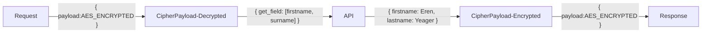

# Example Usage

## ☝️ Table of Contents

- [Example Usage](#example-usage)
  - [☝️ Table of Contents](#️-table-of-contents)
  - [📦 Dependencies](#-dependencies)
  - [⚒ Structure](#-structure)
  - [🏷 Versions](#-versions)
  - [⚙ Get Started](#-get-started)

## 📦 Dependencies

- [x] Golang with GoFiber v2
- [x] Zerolog - Log Management

## ⚒ Structure



Alternative mermaid diagrams
[Alternative mermaid diagrams](./image/mermaid.png)

## 🏷 Versions

v0.1.0

- Initialized
- API Endpoint for Plaintext `POST` [http://localhost:5000/api/example](http://localhost:5000/api/example)
- API Endpoint for Ciphertext `POST` [http://localhost:8000/api/example](http://localhost:8000/api/example)

## ⚙ Get Started

1. Clone project

    ```bash
    git clone https://github.com/buildingwatsize/cipherPayload.git
    ```

2. Go to project folder

    ```bash
    cd cipherPayload/example
    ```

3. Run project by command

    ```bash
    # maybe install dependencies first
    go mod tidy
    ```

4. Run project by command

    ```shell
    go run main.go
    ```

5. "Burn and Learn" with [Postman](https://www.postman.com/) or using [VSCode Extension: REST Client](https://marketplace.visualstudio.com/items?itemName=humao.rest-client)
